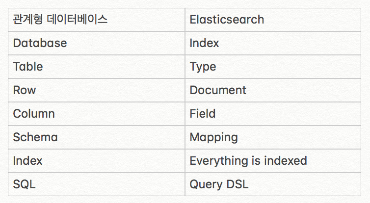

엘라스틱서치의 개념과 용어에 대해 알아본다

## 분산형 RESTful 검색 및 분석 엔진
* 스키마에 자유로운 JSON 문서와 분산 검색을 제공함

## REST API형식
* curl -XPUT, XGET, XDELETE, XOPST http://host:port/(index)/(type)/(id)
* id가 존재하지 않으면, 자동으로 생성됨

## 필수 용어 및 개념
* NTR(Near Time Realtime): 색인부터 검색이 실제로 가능해지는 시점까지 시간(보통 1초)
* 클러스터  
하나이상의 노트(서버)의 집합. 노드는 클러스터에 Assign할 때 이름을 참조하기 때문에 클러스터 명은 고유하게 짓는다. 기본이름: Elastic search
* 노드  
단일서버로서 클러스터 안에 속해있다. 기본적으로  elasticsearch라는 이름의 클러스터에 자동으로 형성되어 일부가 된다. 기본이름: UUID(Universal unique IDentifier)
* Index - Database, Type - Table, Document - Row


## RDBMS 과 Elastic search 비교

* 샤드(Shard)  
일종의 파티션으로서, 데이터를 저장할때 나누어진 부분. 1copy는 primary shard. 각 샤드 자체가 온전한 색인의 기능을 함.
* 레플리카(Replica)  
Primary shard의 복제본으로서, 검색성능과 장애복구를 위해 존재함. RAID와 비슷한 개념
기본갯수: 2개 노드에  Primary shard 5개, Replica shard 5개
* 흔히, 엘라스틱 서치라고 하는데, 일레스틱 서치가 정확한 발음.
